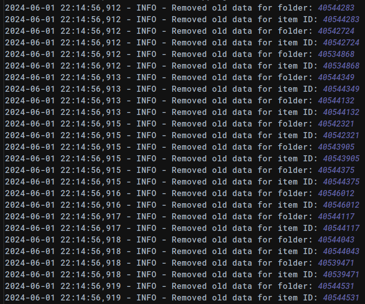

## hn_scraper
### Async crawler for news.ycombinator.com

Задание: написать асинхронный краулер для новостного сайта
news.ycombinator.com:
краулер начинает обкачивать сайт с корня news.ycombinator.com/
краулер должен обкачивать топ новостей, т.е. первые 30 на корневой станице,
после чего ждать появления новых новостей в топе, которых он раньше не
видел
для того, чтобы "скачать" новость нужно скачать непосредственно страницу
на которую она ведет и загрузить все страницы по ссылкам в комментариях к
новости
внутри скачанных страниц далее новые ссылки искать не нужно
скачанная новость со всеми скачанными страницами из комментариев
должна лежать в отдельной папке на диске.

### Реализация

Параллельная(Асинхронная) обработка задач запускается здесь
```python
if item_id not in local_ids:
    tasks.append(parse_item(session, position, item_link, item_id, item_title, folder_name))
```
Ожидаем результат
```python
results = await asyncio.gather(*tasks)
```
Загруженные данные сохраняются в папках (ID публикации). Внутри вложена папка с загруженными комментариями и ссылками.

[]()

Сет из 30 статей снабжен оглавлением в виде downloaded_items.csv, в котором содержится перечень 
статей ранжированных в соответствии с их позицией на главной страние сайта. При каждой обкачке
очередность статей актуализируется.

[]()
[]()

Просмотр загруженных страниц возможен в браузере по абсолютному пути

[]()

Просмотр загруженных комментариев к статье

[]()

Ссылка на youtube активна

[]()

Ссылки основной страницы тоже сохранили работоспособность

[]()
[]()

Мое решение демонстрирует работу корутин. Общее время загрузки в два раза меньше суммы
времени на загрузку каждой статьи. Блокировки сервера обходим с помощью 
```python
semaphore = asyncio.Semaphore(5)
```

[]()

При повторном запуске загружается только новая информация, неактуальные данные удаляются из папки.

[]()
[]()

Оглавление обновляется в соответствии с оригиналом на сайте. Для корректной обработки оглавления
в параллельных потоках используется замок.

```python
async def load_csv():                                                                    
    async with csv_lock:                                                                 
        if os.path.exists(CSV_FILE_PATH):                                                
            async with aiofiles.open(CSV_FILE_PATH, 'r', newline='') as csv_file:        
                lines = await csv_file.readlines()                                       
                rows = list(csv.reader(lines))                                           
                if rows:                                                                 
                    return rows[0], rows[1:]                                             
        return ['position', 'item_id', 'title', 'downloaded_at', 'folder_name'], []      
                                                                                         
                                                                                         
async def save_csv(header, rows):                                                        
    rows.sort(key=lambda x: int(x[0]))                                                   
    async with csv_lock:                                                                 
        output = StringIO()                                                              
        csv_writer = csv.writer(output)                                                  
        csv_writer.writerow(header)                                                      
        csv_writer.writerows(rows)                                                       
        csv_content = output.getvalue()                                                  
                                                                                         
        async with aiofiles.open(CSV_FILE_PATH, 'w', newline='') as csv_file:            
            await csv_file.write(csv_content)                                            
```

Комментарии загружаются только при первой обкачке для ускорения тестирования.

[]()

Работа с оглавлением (.csv заменил в моем случае базу данных) дала прочувствовать сложность работы
с параллельными потоками. Учебное задание - иллюстрация asyncio выполнено, хотя полноценным парсером данный код не является.

[]()

Запускаем спустя несколько часов

[]()

Отчет о загрузке

[]()